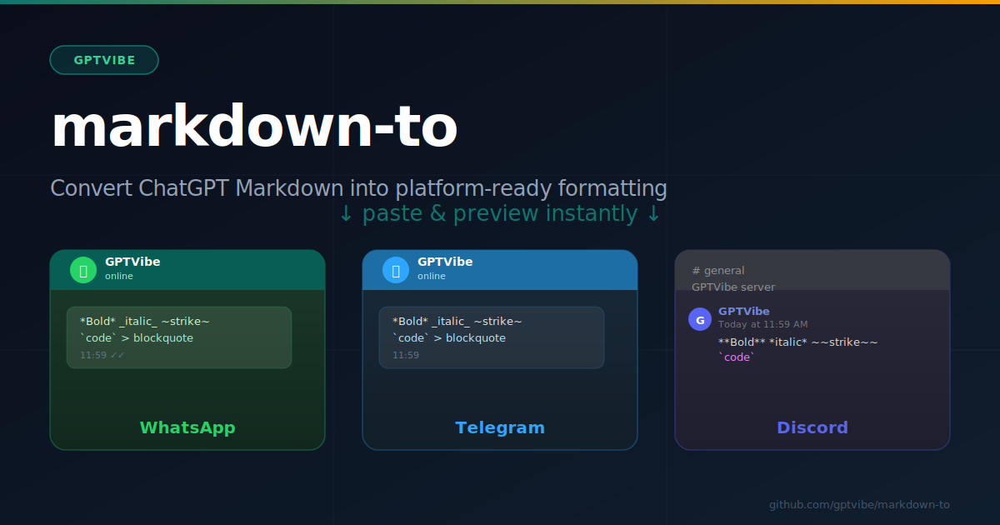

<div align="center">



<br/>

# markdown-to

**Convert ChatGPT-style Markdown into platform-ready formatting for WhatsApp, Telegram, and Discord.**

[](https://hub.docker.com/r/gptvibe/markdown-to)
[](https://github.com/gptvibe/markdown-to/actions/workflows/docker-publish.yml)
[](LICENSE)

</div>

---

## What it does

Paste any ChatGPT response (Markdown) into the left panel, pick your target platform, and instantly get platform-ready text on the right — with a live **platform UI preview** showing exactly how it will look inside WhatsApp, Telegram, or Discord.

- **WhatsApp** — green bubble, `*bold*`, `_italic_`, `~strike~`
- **Telegram** — white bubble, same user-typed syntax
- **Discord** — full dark-mode channel view, `**bold**`, `# headings`, `~~strike~~`

Compatibility warnings flag anything that can't convert cleanly (e.g. tables, links, headings).

## Features

- Parser-first converter — remark AST pipeline, not regex
- Platform-specific output adapters for WhatsApp, Telegram, Discord
- Live chat UI preview per platform (bubbles, colors, fonts)
- Compatibility warnings for degraded or unsupported syntax
- One-click copy to clipboard
- Responsive layout — works on desktop and mobile

## Platform Mapping

| Feature | ChatGPT Markdown | WhatsApp | Telegram | Discord |
| --- | --- | --- | --- | --- |
| Bold | `**text**` | `*text*` | `*text*` | `**text**` |
| Italic | `*text*` | `_text_` | `_text_` | `*text*` |
| Strikethrough | `~~text~~` | `~text~` | `~text~` | `~~text~~` |
| Inline code | `` `text` `` | `` `text` `` | `` `text` `` | `` `text` `` |
| Code block | ` ``` ` | ` ``` ` | ` ``` ` | ` ``` ` |
| Heading | `# H1` | UPPERCASE | UPPERCASE | `# H1` |
| Blockquote | `> text` | `> text` | `> text` | `> text` |
| Link | `[label](url)` | `label (url)` ⚠️ | `[label](url)` | `[label](url)` |
| Underline | `<u>text</u>` | plain text ⚠️ | plain text ⚠️ | `__text__` |
| Table | GFM table | plain-text grid ⚠️ | plain-text grid ⚠️ | plain-text grid ⚠️ |

⚠️ = compatibility warning shown in app

## Run with Docker (recommended)

```bash
# Clone the repo
git clone https://github.com/gptvibe/markdown-to.git
cd markdown-to

# Start (builds image on first run)
docker compose up -d

# Open
open http://localhost:43817
```

Or pull the pre-built image directly from Docker Hub:

```bash
docker run -d -p 43817:80 gptvibe/markdown-to:latest
```

## Run locally

```bash
npm install
npm run dev
```

```bash
npm run build   # production build
npm run test    # run unit tests
```

## Project structure

```
src/
  App.tsx                   # UI, state, layout
  components/
    PlatformPreview.tsx     # Per-platform chat UI renderer
    PlatformPreview.css
  converter/
    convert.ts              # Markdown → platform text engine
    types.ts                # Shared types
    convert.test.ts         # Unit tests
public/
  favicon.svg
  og-image.svg              # Social share image
```

## Adding a new platform

1. Add the new id to `PlatformId` in `src/converter/types.ts`
2. Add adapter rules in `src/converter/convert.ts`
3. Add a chat shell component in `src/components/PlatformPreview.tsx`
4. Add unit tests in `src/converter/convert.test.ts`

---

<div align="center">
Made by <a href="https://github.com/gptvibe">GPTVibe</a>
</div>
